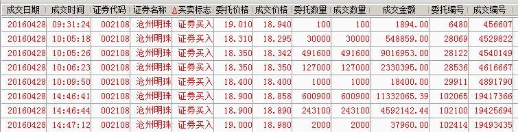
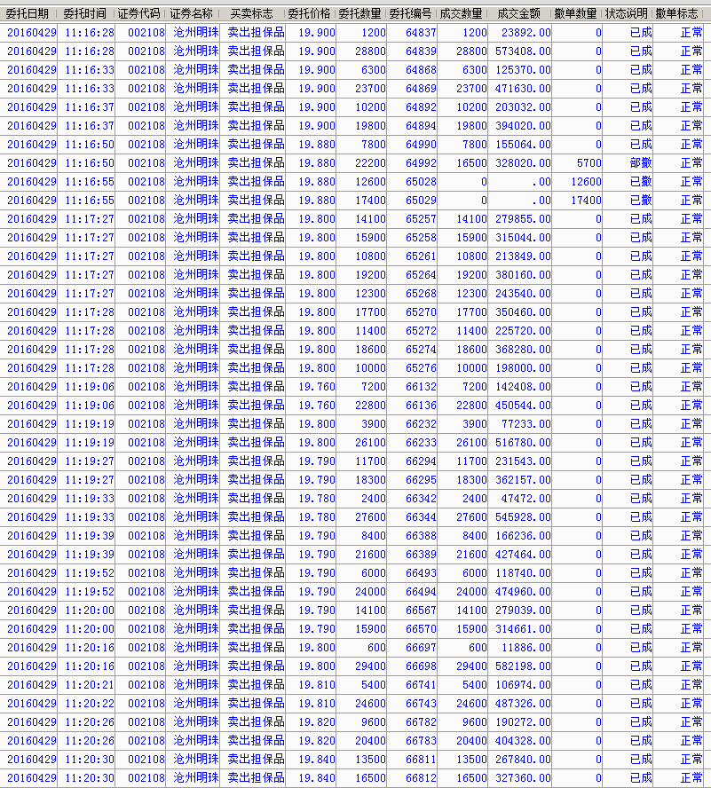
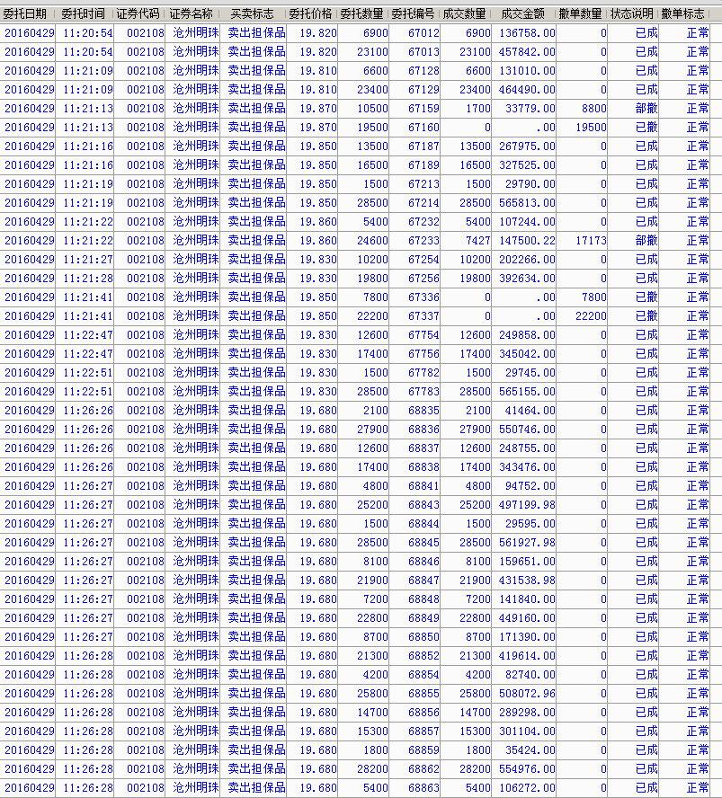
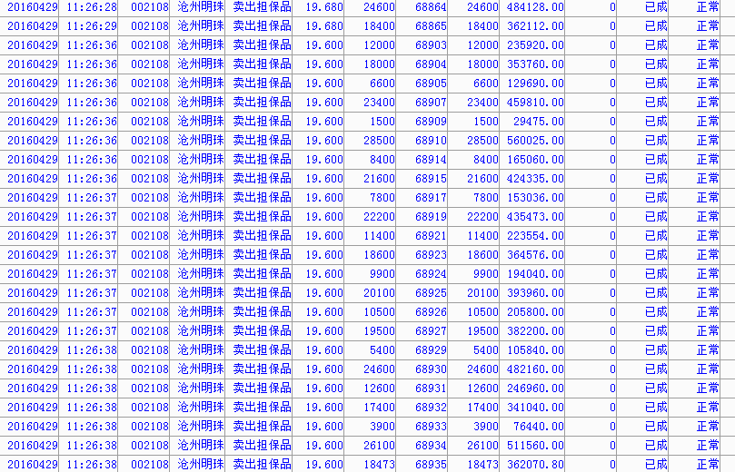
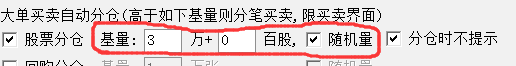
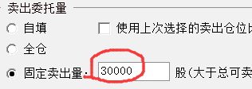
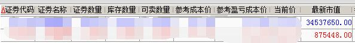

##唯瑞仙马首是瞻
一根大阳线，千军万马来相见

###2016-05-01 10:49
_@二号突击兵 回复 @janu68：_人是牛人，毋庸置疑，但是昨天发这个文章明显就是圆之前的说法而已，给自己台阶下，还要把自己弄的很高尚，这个就没意思了，他说4.13号国家队在盘中砸盘，那么既然你看出来了干嘛还要在4.14的时候发帖来鼓励大家说是慢牛？！自己跑了弄了轻仓玩玩，现在习主席和政治局出来力挺股市了，好了，马上搞得像圣人一样马上出来打了一篇文章安慰小散，还要贴出来交割单，难道他不知道他每次交割单一出来这个股票肯定要被收拾吗？！起码这个股算是废了……说得难听点，就是收割完韭菜还要立贞洁牌坊，呵呵

_@瑞鹤仙 回复 @二号突击兵：_4.13日国家队砸盘，是事实，砸伤了人气资金。但是，我自己揣摩国家队的想法就是要慢牛，用巨大卖单提示游资和市场，悠着点。所以14号才发帖说我的想法。

然后，15号开始，越看越不对劲，14号缩量T字线后，15号必须阳线上涨，否则后果很糟糕，这是技术指标决定的，而慢牛最核心要义就是必须是个牛，再小的牛也是牛，否则就完了。结果15号走成那样，我知道至少要回调几天了，但是只要不破20日线就还可以自发走好。但是我又深入思考，很难理解国家队的做法，既然市场有热情的时候你浇了冷水，那么市场热情退潮的时候你为何不给杯温开水暖胃？涨的时候打压，调整的时候不支持，这如何稳定市场，维持慢牛？——我想不通。虽然15号开始我已经心里很忐忑了，但是我最后决定还是再看看国家队接下来如何出牌。

在这种时候，我自己都看不清，也琢磨不透的时候，我还发帖干什么？自己都没思路，还胡乱指导别人？

4.20日出了大阴线，然后下午国家队救市，真相大白，国家还是要管的，但是还是琢磨不透国家的心思，通过几天的维稳，我看到国家启动了新的救市标的，比如说海通证券类似的还有很多，这意味着国家队内心后悔了。因为开了新仓、加入了新标的，投入了新的资金——这意味着，包袱是加重了、战线拉得更长了。（得不偿失，且摊子越铺越大）

现在最高层提到要股市健康，这说明国家队的确是4.13日的方法出了问题，并不是我内心中想的国家队高人无数，在下大棋局。

所以，现在我自己心中理顺后，就上来发出我的看法，并且写出草根建议，这有何不可？很多人会说，瑞鹤仙你几根葱，敢指点江山。但是，如果大家都麻木不仁，唉声叹气，你也不说他也不语，我们自己股民都不为自己争取利益，那谁来拯救你，我们深爱并痛着的A股呢？！我记得以前在TGB，交易所特停某些没怎么过分涨的股票的时候，大家抱团打电话去投诉，自我救赎和拯救，居然也感动了交易所，放行了。当时的口号好像是，今天大家不争取，下一个受害就是自己。

贴这个交易单，当然知道会引起极大的反感，我又不是傻子。这种世道下，定然会引来无数：质疑、抹黑、讽刺、挖苦、嫉妒、仇恨、等着看笑话的非议，但是仍然还是贴了。为什么，无非是希望国家某股市管理层人员刷雪球，能看到这个帖子，给国家队操盘手说说，政府部门一般都是上面下达指令，下面执行，具体手法和尺度的拿捏也不会说很明细，导致下面也不好办，也不知道怎么去办好。也许，这就是粗暴砸盘的原因，简单的不能再简单的原因。

尽管我人微言轻，但是，国家队别暴力砸盘，这不是我们股民的心声吗？能传到管理层耳朵里面不好吗？就算希望再渺茫，万一实现了呢？

###2016-04-30 23:25
_@瑞鹤仙 回复 @温州爷叔：_其实如果那么惨，大家当然都高兴捡便宜筹码，但是历史经验告诉我，如果再来5年熊市，大多数人，特别是价值投资者，一般都会在半山腰进去，价值投资者的特点就是研究某股票很深入，一旦跌到价值区间，就有非常冲动的买入欲望，而A股特色就是如果下跌走熊，就一定是长期超跌，跌破价值底的，然后价值个股会比价值区间再腰斩甚至更多。然后价值投资者会怀疑人生，然后割肉。就算不割肉，已经亏损50%后，过N年才回本，输了人生啊，人生有几个N年？同样，价值投资者往往股票才刚刚没涨多少后就认为高估了，往往也卖了个半山腰。

N+X年后，年轻人变成中年人，中年人变成老年人，然后资产可能赚了个80%(这算好的了)，期间经历了股市沧桑，大起大落，人老了1圈，原本指望发大财买超跑赢取白富美成为弄潮儿，成为了泡影。

——这是大家想要的人生吗？

恐怕不是吧！

###2016-04-30 22:52
_@积木仁：_国家队是干预了市场吧，怎么说是呵护呢？真的放任下跌的话，估值够低自然会有人买的。感觉你只是从博弈的角度希望国家操控出慢牛，这样反而影响市场，延长熊市。

_@瑞鹤仙 回复 @积木仁：_你这是不了解国情，90%都是散户的股市，都是看趋势的，没人做巴菲特，尤其是国人的跟随性。所以放任下跌，就会越跌越熊，2001-2005经济大牛市股市大熊市，这种极度背离都可以走出来，A股还是什么不能走出来？可以这么说，在A股什么都可以发生，但是绝对不会因为估值足够低后引发牛市的。就是这么一个市场，有时候想想也是可气，可怜之人必有可恨之处，这就是A股——但是现在A股已经大到不能倒，大到都有国际影响力了，这就是和10年前的不同之处。

如果国家不管，真走出大熊市，我相信，到时候股民真的就是尸骨无存，哀鸿遍野了——可能连上雪球发牢骚的力气都没有了，我2012初年开始职业炒股的时候，社会上有谁谈论股市？再回到那个状态，现在还嘴硬希望大幅下跌抄底的人，到时候会亏得找不到北。

——大熊市起家的过来人的感悟。

###2016-04-30 20:39
上次发帖，和以往一样，我是有很大把握才发帖的，根据自己以往经验，胜率很大，才发出来。可是市场打脸了，这的确说明，这个市场没有人能够预测未来，敬畏市场是每个职业投资者的首要任务。

实际上，到目前为止，核心逻辑我仍然没有变（当然3600点没到，所以那核心逻辑不说也罢）。我只说一点，自助者天助。看看别人期货市场、楼市，炒热后社会资金蜂拥而入，挡都挡不住。而我们的股票市场，苟且的活着，怨天尤人，看谁谁不顺眼，全世界都欠着咱的，这样的自我作践，除了发泄外毫无益处。这个社会是公平的，你自己不做出努力，就想让社会回报你，那是不可能的。

社会回报了炒房者，炒商品者，因为别人市场做出了努力。大牛市的确需要存款搬家、人民战争。但是，20%的波动，根本不需要外部资金，存量资金自己就可以做到（往年股市再差都会有年中20%的吃饭行情，就是存量状态下的），你自己都不自尊自爱，别人怎会瞧得上你？

另外说一点，本来4月中旬可以走好的（也就是温和的上涨趋势可以开始进入强化阶段），但是几次盘中大涨，国家队都在涨停板砸人气龙头，极大的挫伤了多头积极性，比如说4.13日冀中能源。这导致了后来涨不上去后市场掉头向下，国家队在市场信心还未恢复之际就开始给市场降温，真是毁了市场！导致4.20日又不得不维稳——绝对是亏本的买卖！！！。我估计国家队现在后悔了。

我也相信国家队想解套，同时也想慢牛，但是你得注意方法，会操盘不？后悔了，就要反思，就要做出改进！

我看3600点仍然未变。这段时间，市场走差之际，我也仍然在市场中，没有清仓，只是仓位比较低，主战场在期货里，在股票里面基本都是低吸，很少追涨，以保持对市场的关注。目前看得出来，即便欧美走得不好，股灾4.0出现的概率几乎低到没有。增量资金是否会入场，取决于存量资金自己做出怎样的努力，社会从来都是锦上添花的，去指望雪中送炭——难道大妈都是慈善家？

贴个昨天的图，我一个自然人散户+普通L2软件，都能做到这样。你国家队啊国家队，请温柔点、呵护一下这个市场吧： 
 
 
 

方法： 
 

买入成本均价：18.63  卖出成本均价：19.76。

再次呼吁，国家队请温柔点，请先鼓励你的股民，信心上来后，再敲打不迟，到时候没人会怪你，反而会感激你，如同一个严父，孩子长大后作出成绩后，一定会感谢父亲严格的教育。但若孩子一直是受气包，信心受挫，即便长大，但成了人生输家。我相信不但你严格教育希望成才的目的没有达到，你会非常后悔；而且你的孩子更是会怨恨你一辈子——整个家庭双输。

最后说明我的态度： 
本来中午是打算空仓过节的，仔细思考后，还是觉得看多逻辑不变，从市场走势来看，看不到发力做空的迹象，所以还是在下午做出了适度持股过节的决定： 

我是持股过节的。

####2016-04-14 19:33
提示一下，本轮慢小牛行情的特点就是：

1、慢+小牛：小得不能再小的小，但仍然是牛；慢的不能再慢的慢，但也仍然是是在向前进。

2、很难爆大量，（也不应该爆大量，也最好不要爆大量）。这应该是【今后股市的新常态】。实际上3千亿左右的上证指数量能是温和的，正常的。注意我强调的重点，“是正常的”。那什么是异常的呢？2015年动则上证超过5000亿，冲击1万亿，这是异常的。

只不过，由于各方被2014年7月22日到2015年6月初11个月的牛市洗脑，所以竟然无法习惯正常的合理的成交量了。同理，被洗脑后，也习惯不了正常温和的推升了。可见2015年大牛市的负面影响的确是深远的。

去年是股市大年，今年是小年无疑(小年不代表就是熊市）。但是，正因为此，各位才应该倍加珍惜当前的美好时光。另外，在可以预见的一段时间内，出现比1-2月更悲观的情况的概率极大降低了，所以，行情兴许会走得更好也未可知（超越3600）。

没有人能预知未来，做股票的核心要义就是判断形势，然后采取策略，让自己尽量把屁股坐到大概率一方的阵营里。

而普通投资者和超高手的区别就在于，超高手没有或者尽量减少定式思维，而普通投资者脑子一时半会转不过来——适用于无论是个股还是大盘，这是普通投资者一辈子无法击穿的“叹息之墙”——不过，一旦击穿了就是超高手了。

####2016-04-05 11:58
`置顶`
我是自己吃大苦，然后走出来后，来做慈善，积功德的。
人在做，天在看。
不是来和普通散户、大小V辩论或者求认同、求认可的。
很多故意胡搅蛮缠、污蔑中伤，想借此引起我的愤怒然后回应的，不要太多！
我即便有这个心，也没有这么多张嘴来回应。

而现在，做到了还发帖提醒大家，只因内心的一句话：“不忘初心、方得始终”。

也不知道还能坚持多久，曾经，你的善良、你的理想、你的信念、你的执着，也经不住岁月的冲刷，经不住各种诋毁，慢慢越来越淡。

####2016-04-04 15:32
_@矾楼酒客：_ 滞胀的风险，一是停滞，二是通胀。而通胀则很容易引发社会动荡，这才是对资产的最大威胁。如果政府加息抑制通胀的话，估计很多资产泡沫要爆掉 
_@瑞鹤仙 回复 @矾楼酒客：_ 通胀，受到损失最大的是草根阶层（可控），富人阶层总有办法抗通胀。而大萧条，紧缩，损失的是所有阶层（不可控）。假如政府加息刺破泡沫，强力紧缩，则大量资产爆破，首先打击的就是富豪，企业家、企业，然后就会破产，倒闭，传导到普通平民百姓，最终是全盘皆输。

所以，滞胀期，各国基本没有啥很好的办法，基本就是靠熬，特别是在我国，几无可能紧缩刺破泡沫。2013年钱荒还记得吗？上台之初，雄心勃勃尚且不了了之，现在泡泡比3年前更大，雄心已然不再，刺破概率更低。

滞胀期，和经济扩张期，最大的不同就是经济停滞，停滞的原因就是我说的②（我个人的理解），扩张期价格上涨可以在各个层级无限传导，螺旋上升，导致扩张。而滞涨期，最终需求不振，传导到最后一环就传不下去了，所以导致后期利润大幅下滑。但是在前期，资产会全面轮动上涨，也就是我说的①。

所以，你说的2大风险，还早，现阶段，先做①。刺破泡沫的政策几乎不会用的。另外，汇率风险几乎没有，全球央行目前已经是合作放水，而谨慎的态度、鹰派的言论，仅仅只停留在嘴巴上而已。

####2016-04-04 11:48
_@相邻路：_ 如果发生滞胀，所有资产都会泥沙俱下，股票也不例外。 
_@瑞鹤仙 回复 @梁宏：_ 这个你不用担心，如果发生滞涨，所有资产都是滞涨。而不是泥沙俱下。

比如说房价，5万一平涨到10万后，就滞涨了，然而并不会崩盘到5万，而是在10万以上盘整，这才叫滞涨。

滞涨、滞涨，是先涨再滞。房价、大宗商品、猪价都涨了，崩了吗？
如果全世界都滞涨了，这反而好了，不会出现大萧条时期的大崩溃，系统性风险反而小了，只是苦了底层人民。

滞涨将会填平任何一个没有涨的资产①，而将大幅上涨的资产滞住②。多了一个②，这就是和经济上升期最大的不同，但是和大萧条那种大崩溃，6124跌到1664是完全不同的。

至于新兴产业估值高的问题，你看看1级市场投资什么就知道了。投资就是为了赚钱的，而1级市场没人投资钢铁煤炭，反而继续再加大投资VR、AI、新能源等科技新兴产业。2级市场难道比1级市场的大鳄还聪明么？

如果房子能在5万一平的价格上再涨5万甚至更多，猪肉能涨50%，那么创业板PE，在能够接受的60倍（A股能够长期接受新兴产业60倍PE）基础之上，翻到120倍，也没有超出普遍范围。

####2016-04-04 11:25
_@梁宏：_ 瑞鹤兄，你怎么看创业板公司估值高的问题，在大牛市里估值高可以不care，但是现在只是波段性行情，超跌反弹的行情也已经有了。但是继续上攻的动力来自于哪里？估值那么高的情况下 
_@瑞鹤仙 回复 @梁宏：_ 来自于货币超发。
货币超发后，一切资产都会估值提升，房子、大宗商品，甚至消费品猪肉而股票也不例外：不是不到，只是会迟到。

####2016-04-04 10:48
节后，会有一波比较大的行情，可以看多高呢？我想，应该可以看到上证指数到3600，但传统产业没什么好投资好炒的，主要还是看新兴产业，重点还是创业板指数，提上证，主要还是考虑到普通散户投资者、雪球一众大、中、小V的接受能力。

是否节后第一个交易日就大涨呢？这个我也拿不准。但是，很近了。启动时间节点，应该在4月中旬之前。

如果你今年1季度很郁闷，很迷茫，那么现在应该积极研究起来。不要灰心丧气，做好你的功课，成为一个有准备的人。

而机会，总是眷顾有准备的人。

每当我心灰意冷、心生倦怠的时候，我脑子中的另一个我时不时的就会跳出来，提醒自己，瑞鹤仙啊，瑞鹤仙，你要记住：

不忘初心，方得始终。

####2016-02-17 15:17
踏空的，现在买，还来得及，跟随趋势。
踏空了，是错误；如果不买，可能更是错误。

别错上加错。

####2016-02-15 15:03
桃李不言，下自成蹊。

####2016-02-13 20:47
节后，低开，加仓，就是这么简单。
a股有自身的规律，反弹并未结束。
这也是为什么作出节前轻仓持股过节决定的原因。
而且提前告诉大家，即便欧美走势不好，问题也不大。
不确定的时候，告诉大家确定的结论，亦如1.8日的大分歧日的帖子。
我想，这就是凭自己的能力做点力所能及事，回馈社会的正能量的途径之一吧。

####2016-02-04 15:17
美联储政策有松动迹象，密切关注这样的积极信号。
轻仓持股过年，即便过年期间外盘走势不好，问题也不大。
轻仓

####2016-01-26 20:10
补充说明一下：
国家不是说要有底线思维吗？各个方面都要有底线思维，股市也不例外。

写一条给国家的来自草根的建议：
请死守上证2444点。这应该是股市的底线，如果跌破2444，那么股市就会彻底走大熊，可能N年也恢复不了。在国家经济转型期，只要守住用近3年铸就的大底部箱体2444点。那么耐心等个1-2年实体经济好转，股市不用出什么政策就能够自我恢复元气。

我并不是建议国家做出人造牛市，而是说在未来2-3年国家经济转型期，股市只要守住2444点不破，那么就还可以支持实体经济，新股IPO、老股再融资、增发，都可以进行，虽然不再走牛但是仍然自我有造血功能还能适度支持实体经济。

一个走N年大熊的股市，会给国际唱空者口实，预期强化，会让资产缩水者绝望，会让实体经济减少直接融资，甚至可能会导致大小非掏空上市公司变现去海外，国家、社会、股民都是输家啊。

虽然希望渺茫，但是万一国家看到并采纳了呢？(祈祷。。。)

####2016-01-26 15:48
看到有人问，什么样的条件下不再看空。回答如下：
1、美联储放弃连续加息，甚至重新降息或者QE4——这代表世界经济坏到连美国都无法再剪羊毛的程度了（损人也损己了）。坏到极点，美国也无法独善其身，开始逆转货币政策。
2、中国宣布降息或者降准（此条件产生后即便经济再差、美国仍然加息也不看空）。——这代表国家至少还可以有货币宽松这个工具来应对经济下滑——目前这个工具被美联储“没收”了。
1或者2，只要有1条符合即可不再看空。全年有效。

没有这2点，代表只有紧缩一条路走到底（即供给侧改革），去产能、破产、下岗、消费缩减、经济下滑 —— 这种情况下，资本市场很难繁荣。

####2016-01-08 05:50
仅此1贴，不代表回归:
到现在还重仓的，后市如果有：高开、反弹、冲高、上涨 。
符合上述任一条件者，减仓走人（够明确了吧，欢迎打脸）。

感谢管理层给了市场，出逃的机会，还要怎样？还能怎样！？

【2016年，请在脑海中放弃“慢牛”这样的自欺欺人式的，定式思维】

祝大家投资顺利，而我则一切安好。（只是好久没上雪球，都不知道该怎么发帖了，登录了5、6次才把这个帖子了发出来。）

最后重复一遍：仅此1贴，不代表回归。
